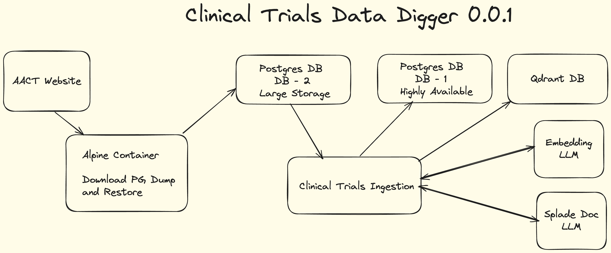
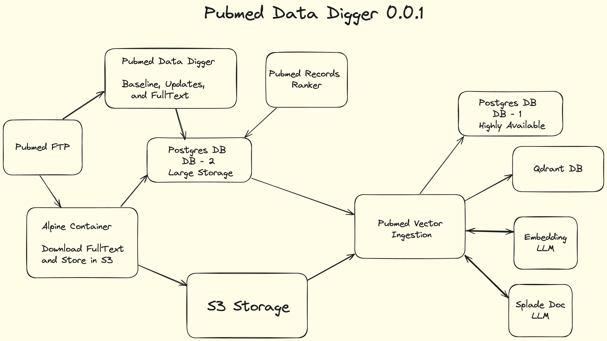
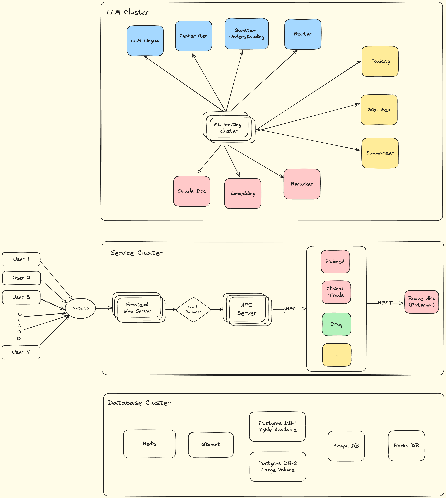
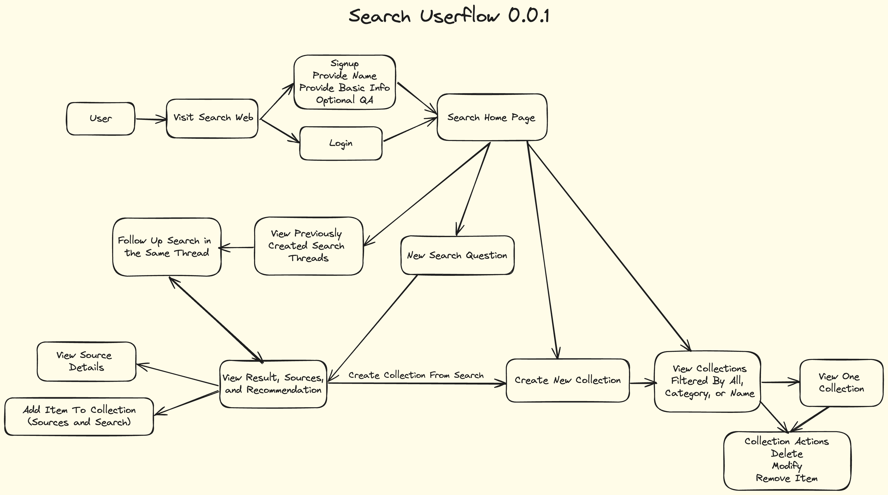
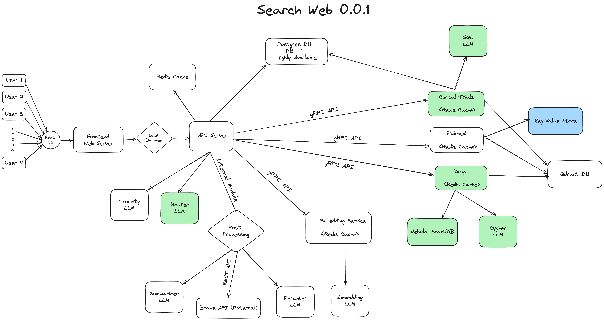
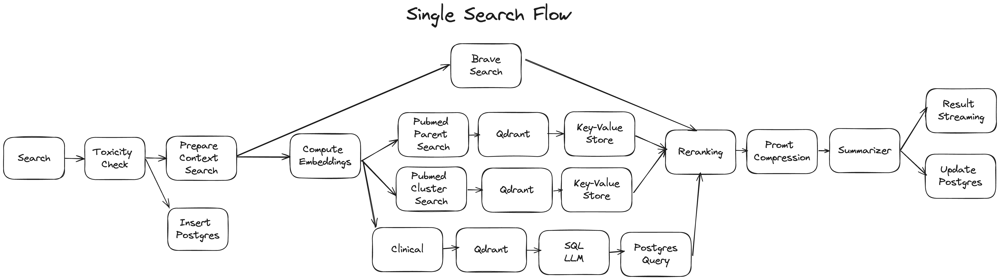
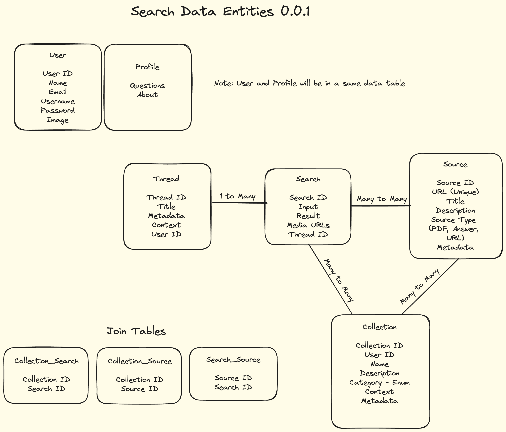

# Search Architecture

## Table of Contents
- [Search Architecture](#search-architecture)
  - [Table of Contents](#table-of-contents)
  - [Introduction](#introduction)
  - [Data Ingestion Services](#data-ingestion-services)
  - [Clinical Trials](#clinical-trials)
    - [High Level Architecture](#high-level-architecture)
  - [Pubmed](#pubmed)
    - [High Level Architecture](#high-level-architecture-1)
  - [Infrastructure High Level Architecture](#infrastructure-high-level-architecture)
  - [Search Web Services](#search-web-services)
  - [User Flow](#user-flow)
    - [Features and User Actions](#features-and-user-actions)
  - [High Level Architecture](#high-level-architecture-2)
  - [Single Search Query Flow](#single-search-query-flow)
  - [Data Models](#data-models)
    - [Frontend](#frontend)
    - [API Server](#api-server)
    - [Agency Modules](#agency-modules)
  - [System Requirements](#system-requirements)
    - [6 Months Usage Projection:](#6-months-usage-projection)
    - [Data Entities and Size:](#data-entities-and-size)
    - [Data Storage](#data-storage)
  - [API Endpoints](#api-endpoints)
    - [Users](#users)
    - [Search](#search)
    - [Sources](#sources)
    - [Threads](#threads)
    - [Collections](#collections)

## Introduction
This document describes the detailed architecture and system requirements for the `Search` application. The `Search` application is a web-based application that allows users to search for information anything related to life sciences and healthcare.

This application is divided into two main components:
1. Data Ingestion Services
2. Search Web Services

## Data Ingestion Services
The `Data Ingestion Services` component is responsible for ingesting the data from various sources and storing it in the responsible database. The component is divided into the following sub-components:
1. Clinical Trials Data Ingestion
2. Pubmed Data Ingestion
3. More to come...

## Clinical Trials

#### Link to Excalidraw Canvas for High Level Architecture: https://excalidraw.com/#room=fc98786bbbb1ff061bb2,wnOTLykNfm9eZsrxGhagAg

### High Level Architecture

## Pubmed

### High Level Architecture

## Infrastructure High Level Architecture

## Search Web Services
The `Search Web Services` component is responsible for providing the search functionality to the users. The component is divided into the following sub-components:
1. Frontend
2. API Server
3. Agency Modules
   1. Clinical Trials
   2. Drugs
   3. Pubmed
   4. Web Search
   5. More to come...

## User Flow

### Features and User Actions
1. **Sign Up**: Users can sign up for the application using their email address or google account. After the sign-up, users will optioanlly provide their personal information e.g. `about`, `location`, `profile picture`, `survey questions` etc.
2. **Sign In**: Users can sign in to the application using their email address or google account.
3. **Search**: Users can search with any query and the system will display the search results and related sources.
4. **Threads**: All of the searches will be stored as a thread. Users can search for more queries in a existing thread or start a new search thread. Users can rename the thread.
5. **History**: Users can view their search history as threads.
6. **Collections**: Users can create collections and view them in a separate page. Users can add search results and sources in the collections. Users can also share the collections with other users. Users can also modify and delete the collections.
7. **Profile**: Users can view their profile and update their personal information.
8. **Settings**: Users can update their password, preferences and other settings.

## High Level Architecture

## Single Search Query Flow

## Data Models

### Frontend
Technologies:
1. Next.js
2. Tailwind CSS
3. Axios API Client

### API Server
Technologies:
1. Rust
2. Axum Web Framework
3. Postgres Database
4. Redis Cache
5. gRPC Client

### Agency Modules
Technologies:
1. Python
2. gRPC Server
3. Llama Index
4. Qdrant Vector Database
5. Postgres Database
6. Nebula Graph Database

## System Requirements

### 6 Months Usage Projection:
1. Users - 5K DAU, 50K Total Users
2. Search - 50K Per Day, 20 RPS at Peak, 10M Total Searches
3. Sources - 5 Unique Sources Per Search, 250K Daily Unique Sources, 50M Total Sources
4. New Collection - 2K Per Day, 0.5M Total Collections
5. New Thread - 5K Per Day, 1M Total Threads
6. Other Actions (View/Modify History, Collections, Profile) - 100K Per Day

### Data Entities and Size:
1. User - 0.1 KB
2. Thread - 0.05 KB
3. Search - 1 KB (1K Words)
4. Sources - 0.2 KB (100 Words)
5. Collection - 0.1 KB

### Data Storage
1. User - 5 MB
2. Thread - 50 MB
3. Search - 10 GB
4. Sources - 10 GB
5. Collection - 50 MB
6. Other Tables - 1 GB

<strong>Total Storage in 6 Months: 25 GB</strong>

## API Endpoints

### Users
1. `POST /signup`
2. `POST /signin`
3. `GET /users/profile`
4. `PATCH /users/profile`
5. `PATCH /users/password`
6. `PATCH /users/preferences`

### Search
1. `GET /search?query=<query>&thread_id=<thread_id>`
2. `GET /history/search?search_id=<search_id>`
3. `GET /history/threads?thread_id=<thread_id>&limit=<limit>&offset=<offset>`
4. `GET /history/threads/all?limit=<limit>&offset=<offset>`

### Sources
1. `GET /sources?source_id=<source_id>`

### Threads
1. `PATCH /threads?thread_id=<thread_id>`

### Collections
1. `POST /collections`
2. `GET /collections?collection_id=<collection_id>&limit=<limit>&offset=<offset>`
3. `PATCH /collections?collection_id=<collection_id>`
4. `DELETE /collections?collection_id=<collection_id>`
5. `GET /collections/all?limit=<limit>&offset=<offset>`
6. `PUT /collections/items?collection_id=<collection_id>`
7. `DELETE /collections/items?collection_id=<collection_id>`